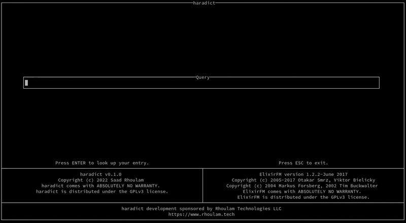

# haradict

**H**askell **Ara**bic **Dict**ionary provides a TUI Arabic dictionary powered by [ElixirFM](https://github.com/otakar-smrz/elixir-fm).

Currently, only lookup functionality is supported. ElixirFM is capable of providing more much functionality, such as verb inflections, which haradict will hopefully support in the future.

## Build

`stack build`

## Execute

`stack exec -- haradict`
